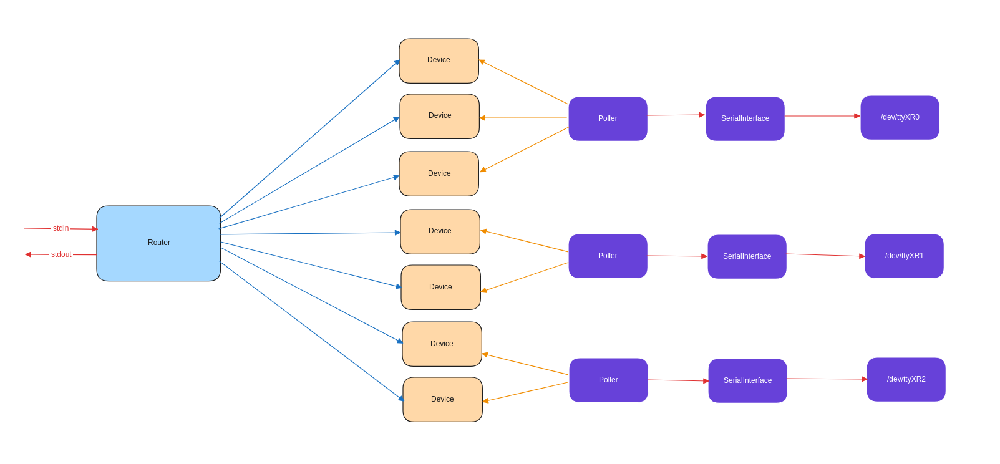

# Modbus Router Library

The Modbus Router Library is a Rust framework designed to facilitate the routing of Modbus RTU (RS485)
requests between a central application and multiple serial devices (VFD, Joystick, etc...) dispached on 
severals ports. This library is modular, allowing users to extend functionality easily by adding new 
device types and communication protocols.

# Structure

 - Router: The router is the single communication interface between the application
   and the devices states, it should implement [Routing](./src/lib/traits/routing.rs) trait.
   A router implementation for stdin/stdout can be found [here](./src/lib/router.rs).
   A python implementation for a client connecting to the router via stdin/stdout can
   be found [here](./python/modbus_router/modbus.py).
 - External Request/Responses: Requests/Responses between application and `Router` should implement
   [RequestFn & ResponseFn](./src/lib/traits/request.rs) traits. Example implementation can be found
   [here](./src/lib/soft_request.rs).
 - Device: Devices are representing devices states, multiple devices states can be
   managed for a single serial port. Device should implement the [Device](./src/lib/traits/device.rs)
   trait. Examples implementations can be found in [devices](./src/lib/devices/) folder.
 - Device Encoders: Encoders purpose is to convert `Device` `Request`/`Responses` into serial
   raw data. Encoder should implement the [DeviceEncoder](./src/lib/traits/device_encoder.rs) trait.
   Examples implementations are available in [devices](./src/lib/devices/) folder.
 - Pollers: There is one poller for each serial port, the role of the poller is to loop
   poll on every device state in order to dispach their request on the serial port and return
   back responses to device states. Pollers should implement the [Polling](./src/lib/traits/polling.rs)
   trait, an example implementation to interract with [serial-thread](https://github.com/pythcoiner/serial-thread-rust) 
   can be found [here](./src/lib/poller.rs).

# Example

A simple example can be found [here](./src/example.rs)
